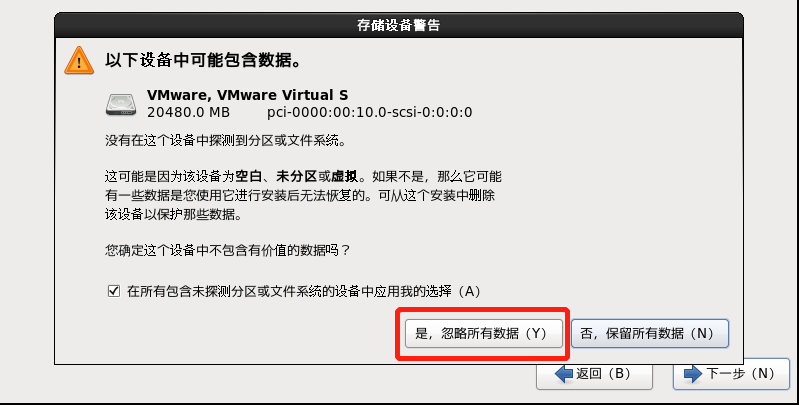
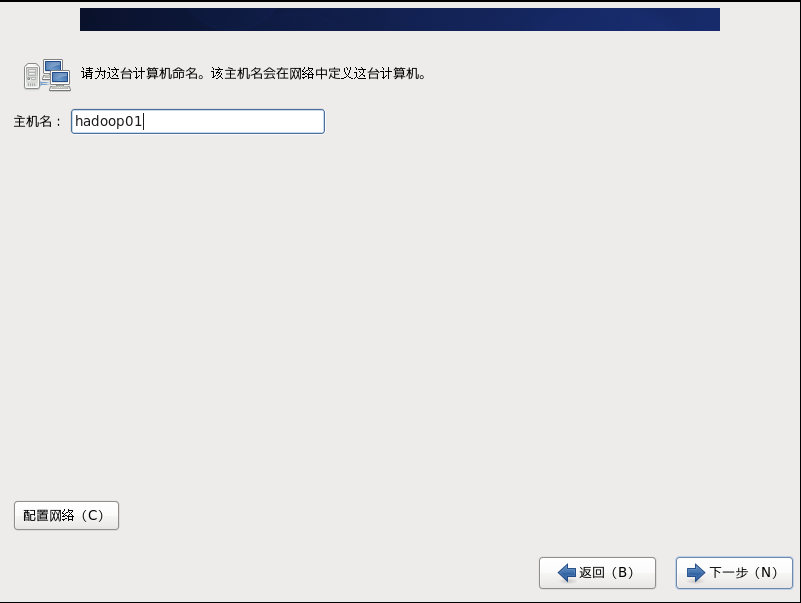
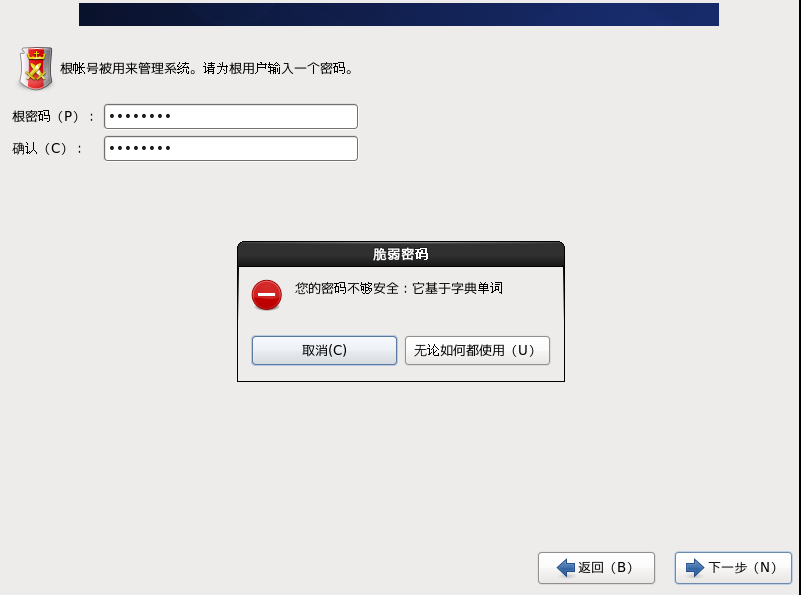
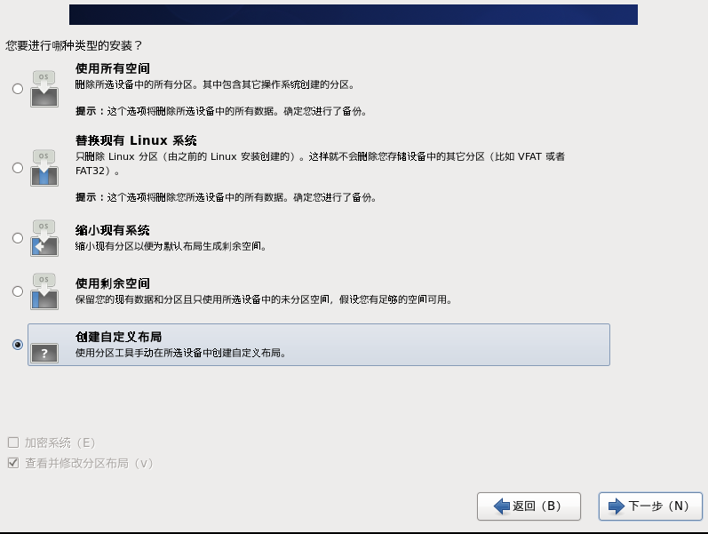
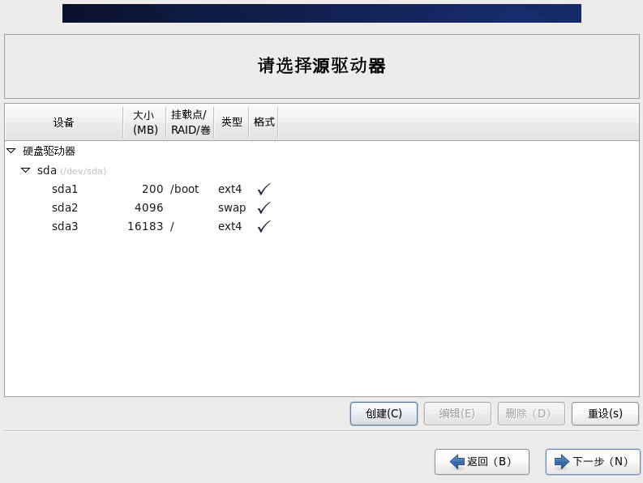
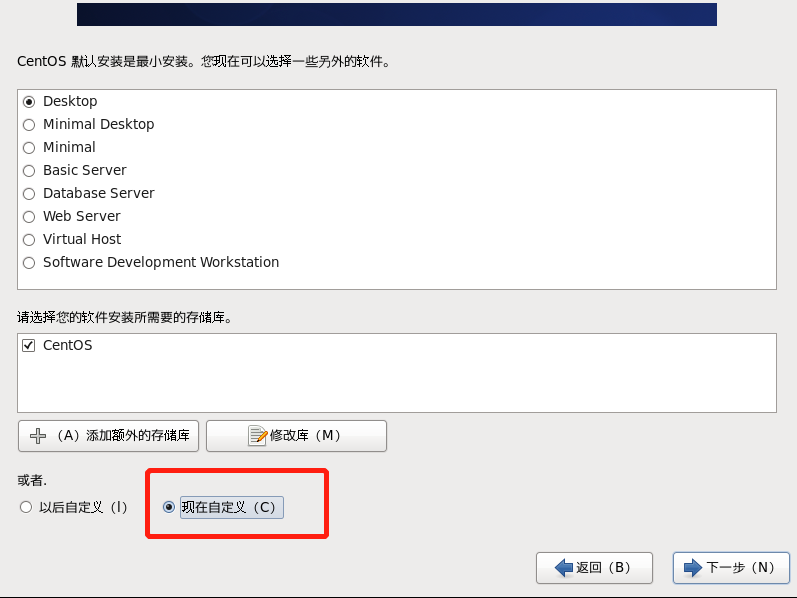
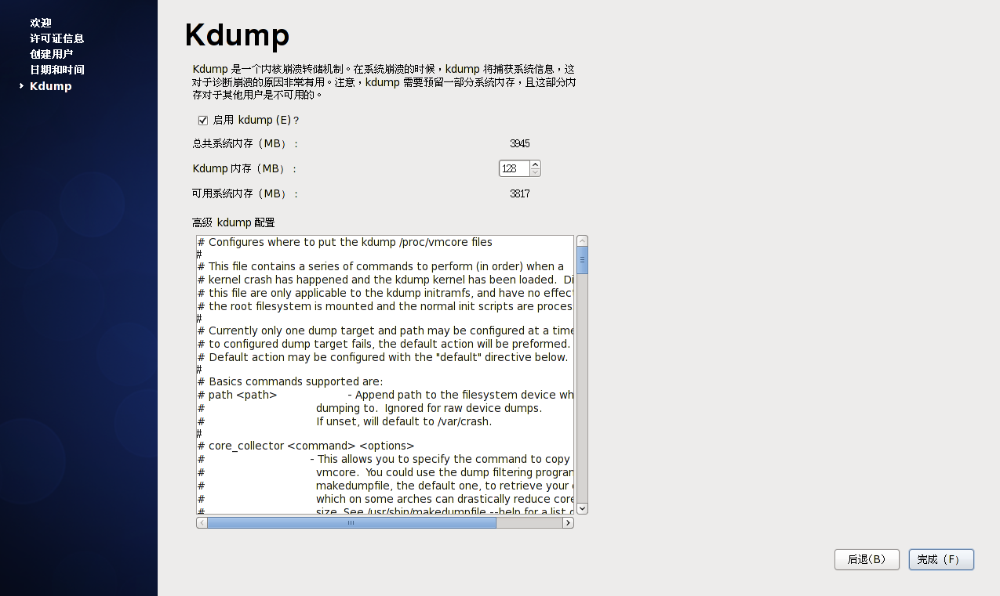

从这里，我就开始正式记录自己的学习历程，各种操作步骤也会非常详细，如果大家用的东西都和我完全一样的话，那我们今后遇到的问题也都一样，可以方便交流，由于我的各项系统已经安装好，为了给大家做这个教程，不得已要从来一遍，T_T

虚拟机软件当然是用最流行的Vmware，版本是**VMware Workstation Pro 15。**

## 1、新建虚拟机

这里我准备安装的是CentOS 6.8 x 64位系统，所以这么选择没毛病。

虚拟机名称和存储位置都要改一下，最好别放在C盘，到后来存储的东西越来越多，对C盘不好。

磁盘大小为默认的20GB就好，反正到后面也可以改。

直接点完成！！！

## 2、配置虚拟机

在新创建的虚拟机上右键—设置：

**1）内存**

既然有了大内存，所以这里不要虚，直接干到4G

**2）处理器**

这里要看自己电脑的CPU情况，比如我是4核，8处理器，那我虚拟机就设置2核2处理器，也不过分。

**3）CD/DVD**

这里要选择下载好的ISO系统镜像文件，我选择的是CentOS6.8 64位的ISO文件。

**4）网络适配器**

选择NAT模式：用于共享主机的IP地址。

至于这几者有什么区别，大家可以自行百度，选择这个模式的好处很多，既能保证本机和虚拟机的IP不冲突，虚拟机和本机所在局域网其他机器的IP不冲突，也能保证虚拟机能联上Internet网。

最后点击确定，虚拟机即配置完成，接下来就是安装系统了。

## 3、安装Linux系统

直接点击开启此虚拟机。

弹出如下界面，选择第一项，按下Enter键（PS：如果想让鼠标回到本机，则需按住Ctrl + Alt）

弹出框直接选择Skip，在虚拟机中要按Tab键

然后一路Next，选择系统语言为中文简体

键盘为美国英语式

选择基础存储设备

点 是，忽略所有数据

主机名设置：hadoop01

下一步，时区一般都是默认的亚洲/上海

下一步，设置root用户的密码，由于我设置的密码比较简单，所以弹出这个窗口，忽略他。

下一步，点击，创建自定义布局：自己手动设置各种分区

分区：

/boot分区，默认200M

swap分区：大小为虚拟机内存大小，我这里是4096M

/根分区：分配剩余的全部空间

整个分配完，为如下界面

点击下一步，格式化磁盘

直接下一步，选择现在自定义

主要勾选的也就是如下几个组件：

【基本系统】：兼容程序库，基本，调试工具

【应用程序】：互联网浏览器

【桌面】：默认勾选

【语言支持】：默认勾选

正式开始安装，一共是1017个包

安装完成后，点击重新引导

开启系统后，一直前进前进，中间无需创建用户，无需设置日期和时间，后面进入系统后再用命令设置即可。

下面Kdump是为内存崩溃服务的，这个东西需要耗费点内存，在实际开发中还是打开比较好。

点击完成后，系统重新启动！

