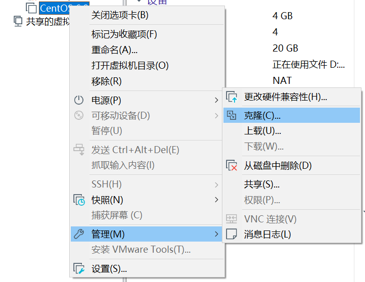
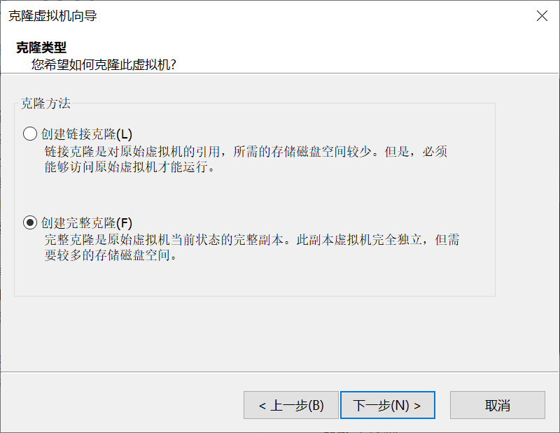
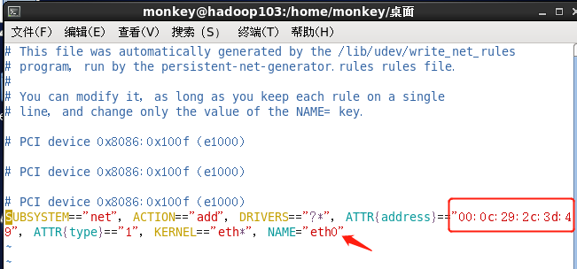
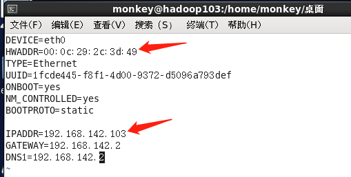
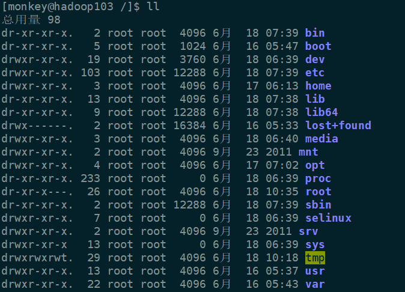

##  克隆虚拟机

一直下一步，选取创建完整克隆

后面就是设置虚拟机名称和存储位置，不再累赘。

这里我们克隆出2台虚拟机，分别叫hadoop103和hadoop104。

## 修改IP

1、找到真实的物理地址：`vim /etc/udev/rules.d/70-persistent-net.rules`

更改NAME为eth0，记住要把ATTR地址给复制下来，留作备用。

2、修改IP：`vim /etc/sysconfig/network-scripts/ifcfg-eth0`

将前面复制的ATTR物理地址给替换掉，并修改IP。

3、刷新网络：`service network restart`

 

## 修改主机名

操作之前有说过，不再详细说。

`vim /etc/sysconfig/network`

修改HOSTNAME=hadoop103

---

hadoop104的操作和以上一样，大家可自行操作。

## 小Tips

很多人觉得Vmware的虚拟机不好操作，那么简单，使用第三方的远程连接软件就行了，我本人用户的是Xshell 6 + Xftp 6套装，这样连接，传输文件两不误。

具体的安装步骤网上有很多，大家自行搜索，怎么连接虚拟机也很简单，这里不做说明。

有人觉得Xshell的初始界面有点丑，没关系，这个也是可以自定义的，网上有很多主题代码，我自己也是从网上copy的，需要可以私信我。

