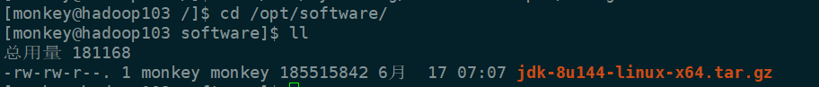
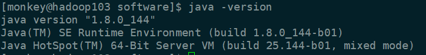
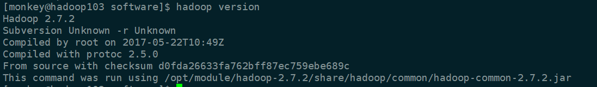
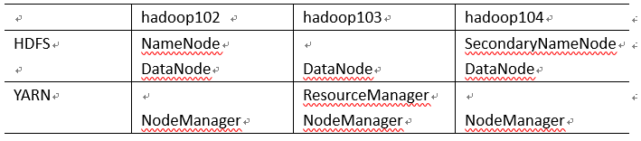
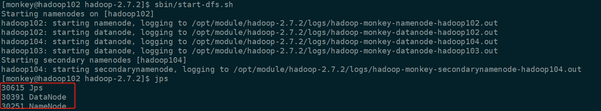
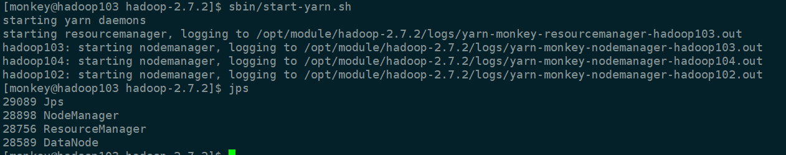

从此篇开始，我们就正式开始学习大数据了，有没有很激动？没错，我的大刀也已经饥渴难耐了！

## 一、安装JDK

其实这一步骤，应该在克隆虚拟机之前的，不然还得在3台虚拟机上都执行同样的操作，有点蛋疼。

在/opt目录下创建module、software文件夹

```shell
sudo mkdir module
sudo mkdir software
```

修改module、software文件夹的所有者：`sudo chown monkey:monkey module/ software/`

**1、卸载现有jdk**

查询是否安装java软件：`rpm -qa | grep java`

如果安装版本低于1.7，卸载软件包：`sudo rpm -e 软件包`

**2、利用Xftp工具将jdk文件传到虚拟机software文件夹**

查看是否导入成功



**3、解压JDK到/opt/module目录下**

`tar -zxvf jdk-8u144-linux-x64.tar.gz -C /opt/module/`

**4、配置JDK环境变量**

1）获取JDK安装路径：/opt/module/jdk1.8.0_144

2）打开/etc/profile文件：`sudo vi /etc/profile`

添加：

\#JAVA_HOME

export JAVA_HOME=/opt/module/jdk1.8.0_144

export PATH=\$PATH:$JAVA_HOME/bin

3）使修改文件生效：`source /etc/profile`

**5、测试JDK是否安装成功**




## 二、安装Hadoop（在hadoop102上）

**1、将hadoop-2.7.2.tar.gz导入到software文件夹下**

**2、解压**

`tar -zxvf hadoop-2.7.2.tar.gz -C /opt/module/`

**3、查看是否解压成功：**`ls /opt/module/hadoop-2.7.2`

**4、将Hadoop添加到环境变量**

1）获取Hadoop安装路径：/opt/module/hadoop-2.7.2

2）打开/etc/profile文件：`sudo vi /etc/profile`

添加：

#HADOOP_HOME

export HADOOP_HOME=/opt/module/hadoop-2.7.2

export PATH=\$PATH:$HADOOP_HOME/bin

export PATH=\$PATH:$HADOOP_HOME/sbin

3）使修改文件生效：`source /etc/profile`

**5、测试是否安装成功**




## 三、完全分布式运行模式

由于我们是有3台虚拟机的，所以不用搞什么本地模式和伪分布模式了，直接模拟企业的真实环境。

**1、编写集群分发脚本xsync**

编写这个脚本，主要是为了以后安装各种组件，能快速的分发复制到其他虚拟机上，省去了很多力气。

在/home/monkey目录下创建bin目录，并在bin目录下xsync创建文件

```shell
#!/bin/bash
#1 获取输入参数个数，如果没有参数，直接退出
pcount=$#
if((pcount==0)); then
echo no args;
exit;
fi

#2 获取文件名称
p1=$1
fname=`basename $p1`
echo fname=$fname

#3 获取上级目录到绝对路径
pdir=`cd -P $(dirname $p1); pwd`
echo pdir=$pdir

#4 获取当前用户名称
user=`whoami`

#5 循环
for((host=103; host<105; host++)); do
        echo ------------------- hadoop$host --------------
        rsync -rvl $pdir/$fname $user@hadoop$host:$pdir
done
```

修改脚本 xsync 具有执行权限：`chmod 777 xsync`

调用脚本形式：xsync 文件名称  `xsync /home/monkey/bin`

**2、集群配置**



配置集群核心文件：

`cd /opt/module/hadoop-2.7.2/etc/hadoop/`

1）core-site.xml：指定一个节点运行hdfs服务

```shell
<configuration>

<!-- 指定HDFS中NameNode的地址 -->
<property>
      <name>fs.defaultFS</name>
      <value>hdfs://hadoop102:9000</value>
</property>

<!-- 指定Hadoop运行时产生文件的存储目录 -->
<property>
      <name>hadoop.tmp.dir</name>
      <value>/opt/module/hadoop-2.7.2/data/tmp</value>
</property>

</configuration>
```

2）hdfs-site.xml：与HDFS相关

```shell
<configuration>

<property>
      <name>dfs.replication</name>
      <value>3</value>
</property>

<!-- 指定Hadoop辅助名称节点主机配置 -->
<property>
      <name>dfs.namenode.secondary.http-address</name>
      <value>hadoop104:50090</value>
</property>

</configuration>
```

3）yarn-site.xml：与资源管理模块YARN相关

```shell
<configuration>

<!-- Site specific YARN configuration properties -->

<!-- Reducer获取数据的方式 -->
<property>
        <name>yarn.nodemanager.aux-services</name>
        <value>mapreduce_shuffle</value>
</property>

<!-- 指定YARN的ResourceManager的地址 -->
<property>
        <name>yarn.resourcemanager.hostname</name>
        <value>hadoop103</value>
</property>


</configuration>
```

4）mapred-site.xml：mapreduce运行历史记录监控端口和网页端口

`cp mapred-site.xml.template mapred-site.xml`

`vi mapred-site.xml`

```shell
<configuration>

<!-- 指定MR运行在Yarn上 -->
<property>
        <name>mapreduce.framework.name</name>
        <value>yarn</value>
</property>

</configuration>
```

5）hadoop-env.sh：添加JAVA_HOME环境变量

export JAVA_HOME=/opt/module/jdk1.8.0_144

6）yarn-env.sh：添加JAVA_HOME环境变量

export JAVA_HOME=/opt/module/jdk1.8.0_144

**3、在集群上分发配置好的Hadoop配置文件**

`xsync /opt/module/hadoop-2.7.2/`

**4、查看文件分发情况**

去103，104分别查看下：`cat /opt/module/hadoop-2.7.2/etc/hadoop/core-site.xml`


## 四、SSH无密登录配置

`cd /home/monkey/.ssh`

**1、生成公钥和私钥**

`ssh-keygen -t rsa`

然后敲（三个回车），就会生成两个文件id_rsa（私钥）、id_rsa.pub（公钥）

**2、将公钥拷贝到要免密登录的目标机器上**

```shell
ssh-copy-id hadoop102
ssh-copy-id hadoop103
ssh-copy-id hadoop104
```

==注意：==

==还需要在hadoop102上采用root账号，配置一下无密登录到hadoop102、hadoop103、hadoop104；==

==还需要在hadoop103上采用monkey账号配置一下无密登录到hadoop102、hadoop103、hadoop104服务器上。==


## 五、群起集群

**1、配置slaves**

`cd /opt/module/hadoop-2.7.2/etc/hadoop/`

`vi slaves`

在文件中添加如下信息：

> hadoop102
>
> hadoop103
>
> hadoop104

同步所有节点：`xsync slaves`

**2、启动集群**

1）如果集群是第一次启动，需要格式化NameNode（==注意格式化之前，一定要先停止上次启动的所有namenode和datanode进程，然后再删除data和log数据==）

`bin/hdfs namenode -format`

2）启动HDFS

进入到/opt/module/hadoop-2.7.2目录下

`sbin/start-dfs.sh`

再jps查看




3）启动YARN

`sbin/start-yarn.sh`

==注意：NameNode和ResourceManger如果不是同一台机器，不能在NameNode上启动 YARN，应该在ResouceManager所在的机器上启动YARN。这里我们是打算在hadoop103上启动ResourceManger。==



4）Web端查看SecondaryNameNode

浏览器中输入：http://hadoop104:50090/status.html，即可查看SecondaryNameNode信息。


## 六、集群时间同步

后来我们要做各种测试，项目，等都需要集群时间要保持一致，所以这块也要设置下。

时间同步的方式：找一个机器，作为时间服务器，所有的机器与这台集群时间进行定时的同步，比如，每隔十分钟，同步一次时间。

**1、时间服务器配置（必须root用户）**

1）检查ntp是否安装

`rpm -qa|grep ntp`


2）修改ntp配置文件

`vi /etc/ntp.conf`

修改内容如下

a）修改1（授权192.168.1.0-192.168.1.255网段上的所有机器可以从这台机器上查询和同步时间）

**#**restrict 192.168.1.0 mask 255.255.255.0 nomodify notrap为

==restrict 192.168.1.0 mask 255.255.255.0 nomodify notrap==

b）修改2（集群在局域网中，不使用其他互联网上的时间）

server 0.centos.pool.ntp.org iburst

server 1.centos.pool.ntp.org iburst

server 2.centos.pool.ntp.org iburst

server 3.centos.pool.ntp.org iburst为

==**#**server 0.centos.pool.ntp.org iburst==

==**#**server 1.centos.pool.ntp.org iburst==

==**#**server 2.centos.pool.ntp.org iburst==

==**#**server 3.centos.pool.ntp.org iburst==

c）添加3（当该节点丢失网络连接，依然可以采用本地时间作为时间服务器为集群中的其他节点提供时间同步）

server 127.127.1.0

fudge 127.127.1.0 stratum 10


3）修改/etc/sysconfig/ntpd 文件

`vim /etc/sysconfig/ntpd`

增加内容如下（让硬件时间与系统时间一起同步）

SYNC_HWCLOCK=yes

4）重新启动ntpd服务

`service ntpd status`

`service ntpd start`

5）设置ntpd服务开机启动

`chkconfig ntpd on`


**2、其他机器配置（必须root用户）**

1）在其他机器配置10分钟与时间服务器同步一次

`crontab -e`

编写定时任务如下：

*/10 * * * * /usr/sbin/ntpdate hadoop102

2）修改任意机器时间

`date -s "2017-9-11 11:11:11"`

3）十分钟后查看机器是否与时间服务器同步

`date`

==说明：测试的时候可以将10分钟调整为1分钟，节省时间。==


