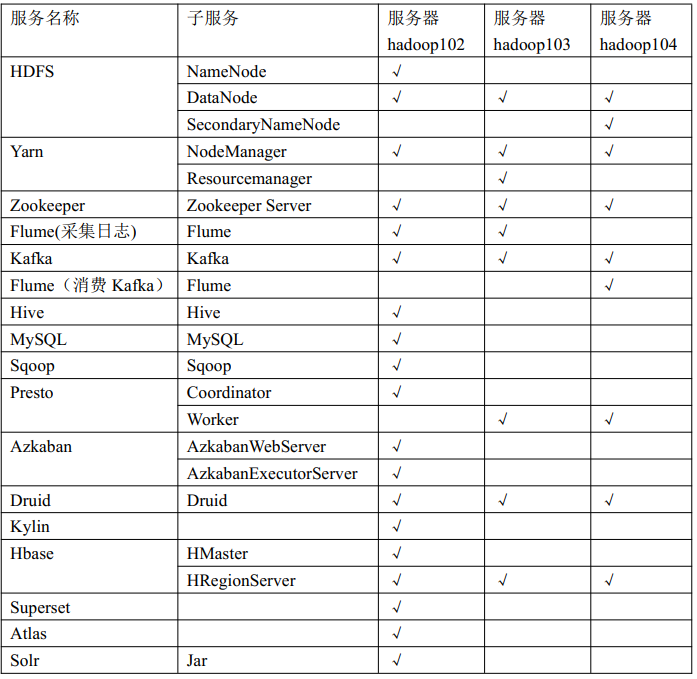
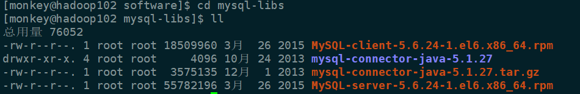

**从此篇开始，我将利用一个==电商的大数据数据仓库项目==，实际的去讲一下各种组件的安装和操作。**

图片镇楼~~~



关于Hive的重点知识，大家可以自行搜索，特别是Hive SQL如何转换为MapReduce任务的，其中最常见的数据倾斜是怎么发生的，如原理什么，如何避免，这需要大家多理解理解，对以后优化Hive SQL帮助很大。

由于一般而言Hive的元数据是存在MySQL中的，因此我们要先安装MySQL。


## 安装MySQL

**1、安装包准备**

1） 查看 MySQL 是否安装， 如果安装了， 卸载 MySQL
（1） 查看
`[root@hadoop102 桌面]# rpm -qa|grep mysql`
mysql-libs-5.1.73-7.el6.x86_64
（2） 卸载
`[root@hadoop102 桌 面 ]# rpm -e --nodeps mysql-libs-5.1.73-7.el6.x86_64`
2） 解压 mysql-libs.zip 文件到当前目录
`[root@hadoop102 software]# unzip mysql-libs.zip`
`[root@hadoop102 software]# ls`
mysql-libs.zip
mysql-libs
3） 进入到 mysql-libs 文件夹下



**2、安装MySQL服务器**

1） 安装 mysql 服务端
`[root@hadoop102 mysql-libs]# rpm -ivh`
MySQL-server-5.6.24-1.el6.x86_64.rpm
2） 查看产生的随机密码
`[root@hadoop102 mysql-libs]# cat /root/.mysql_secret`
OEXaQuS8IWkG19Xs
3） 查看 mysql 状态
`[root@hadoop102 mysql-libs]# service mysql status`
4） 启动 mysql
`[root@hadoop102 mysql-libs]# service mysql start  `


**3、安装MySQL客户端**

1） 安装 mysql 客户端
`[root@hadoop102 mysql-libs]# rpm -ivh`
MySQL-client-5.6.24-1.el6.x86_64.rpm
2） 连接mysql
`[root@hadoop102 mysql-libs]# mysql -uroot -pOEXaQuS8IWkG19Xs`
3） 修改密码
`mysql>SET PASSWORD=PASSWORD('root');`
4） 退出 mysql
`mysql>exit  `


**4、MySQL 中 user 表中主机配置**  

进入 mysql
`[root@hadoop102 mysql-libs]# mysql -uroot -proot`

```mysql
mysql>use mysql;
mysql>select User, Host, Password from user;
mysql>update user set host='%' where host='localhost';
# 删除 root 用户的其他 host
mysql>delete from user where Host='hadoop102';
mysql>delete from user where Host='127.0.0.1';
mysql>delete from user where Host='::1';
# 刷新
mysql>flush privileges;
# 退出
mysql>quit;
```


## 安装Hive和配置

**1、Hive安装及配置**

（1） 把 apache-hive-1.2.1-bin.tar.gz 上传到 linux 的/opt/software 目录下
（2） 解压 apache-hive-1.2.1-bin.tar.gz 到/opt/module/目录下面

`tar -zxvf apache-hive-1.2.1-bin.tar.gz -C /opt/module/`

（3） 修改 apache-hive-1.2.1-bin.tar.gz 的名称为 hive
`mv apache-hive-1.2.1-bin/ hive`
（4） 修改/opt/module/hive/conf 目录下的 hive-env.sh.template 名称为 hive-env.sh
`mv hive-env.sh.template hive-env.sh`
（5） 配置 hive-env.sh 文件
	（a） 配置 HADOOP_HOME 路径
		`export HADOOP_HOME=/opt/module/hadoop-2.7.2`
	（b） 配置 HIVE_CONF_DIR 路径
		`export HIVE_CONF_DIR=/opt/module/hive/conf`


**2、Hadoop 集群配置**
（1） 必须启动 hdfs 和 yarn
`[monkey@hadoop102 hadoop-2.7.2]$ sbin/start-dfs.sh`
`[monkey@hadoop103 hadoop-2.7.2]$ sbin/start-yarn.sh`
（2） 在 HDFS 上创建/tmp 和/user/hive/warehouse 两个目录并修改他们的同组权限可写
`[monkey@hadoop102 hadoop-2.7.2]$ bin/hadoop fs -mkdir /tmp`
`[monkey@hadoop102 hadoop-2.7.2]$ bin/hadoop fs -mkdir -p /user/hive/warehouse`
`[monkey@hadoop102 hadoop-2.7.2]$ bin/hadoop fs -chmod g+w /tmp`
`[monkey@hadoop102 hadoop-2.7.2]$ bin/hadoop fs -chmod g+w /user/hive/warehouse  `


## Hive 元数据配置到 MySQL

**1、驱动拷贝**

1）在/opt/software/mysql-libs 目录下解压 mysql-connector-java-5.1.27.tar.gz 驱动包

`[root@hadoop102 mysql-libs]# tar -zxvf mysql-connector-java-5.1.27.tar.gz`
2）拷 贝 /opt/software/mysql-libs/mysql-connector-java-5.1.27 目录下的mysql-connector-java-5.1.27-bin.jar到/opt/module/hive/lib/
`[root@hadoop102 mysql-connector-java-5.1.27]# cp mysql-connector-java-5.1.27-bin.jar
/opt/module/hive/lib/  `


**2、配置 Metastore 到 MySQL**

在/opt/module/hive/conf 目录下创建一个 hive-site.xml
`[monkey@hadoop102 conf]$ touch hive-site.xml`
`[monkey@hadoop102 conf]$ vi hive-site.xml`

> <?xml version="1.0"?><?xml-stylesheet type="text/xsl" href="configuration.xsl"?><configuration><property><name>javax.jdo.option.ConnectionURL</name><value>jdbc:mysql://hadoop102:3306/metastore?createDatabaseIfNotExist=true</value><description>JDBC connect string for a JDBC metastore</description></property><property><name>javax.jdo.option.ConnectionDriverName</name><value>com.mysql.jdbc.Driver</value><description>Driver class name for a JDBC metastore</description></property><property><name>javax.jdo.option.ConnectionUserName</name><value>root</value><description>username to use against metastore database</description></property><property><name>javax.jdo.option.ConnectionPassword</name><value>root</value><description>password to use against metastore database</description></property></configuration> 


## Hive基本操作

```shell
（1） 启动 hive
[monkey@hadoop102 hive]$ bin/hive
（2） 查看数据库
hive> show databases;
（3） 打开默认数据库
hive> use default;
（4） 显示 default 数据库中的表
hive> show tables;
（5） 创建一张表
hive> create table student(id int, name string);
（6） 显示数据库中有几张表
hive> show tables;
（7） 查看表的结构
hive> desc student;
（8） 向表中插入数据
hive> insert into student values(1000,"ss");
（9） 查询表中数据
hive> select * from student;
（10） 退出 hive
hive> quit;
```

在实际操作中，show databases;报错了，信息如下：

FAILED: SemanticException org.apache.hadoop.hive.ql.metadata.HiveException: java.lang.RuntimeException: Unable to instantiate org.apache.hadoop.hive.ql.metadata.SessionHiveMetaStoreClient

**原因为metastore服务未启动，直接在bin目录下执行`hive --service metastore & `，接着按Ctrl+C，再进入到hive中。**


