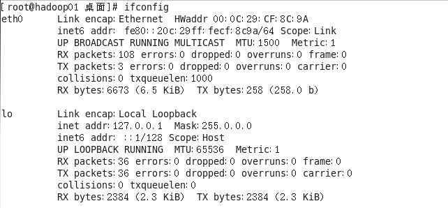
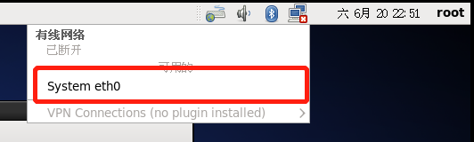
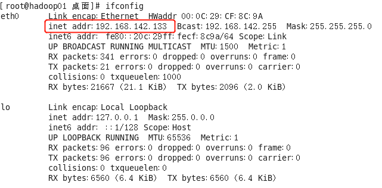
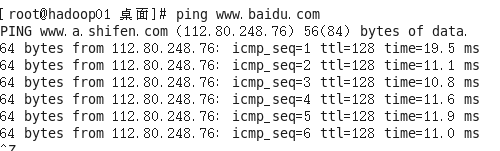
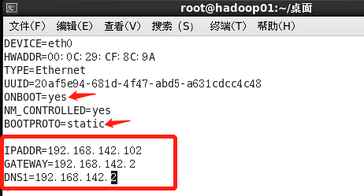
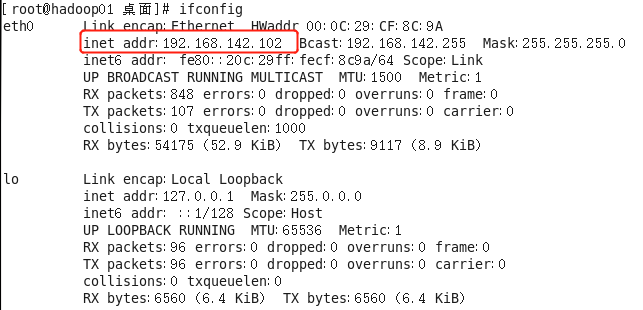
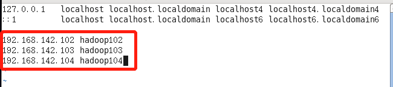
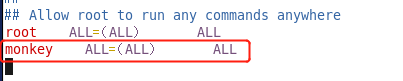

## 网络

进入系统后打开终端，运行`ifconfig`后发现，没有IP地址？然后连不上外网，ping不通baidu。



不要慌，老司机来指路。此时点击右上角的红色×，选中System eth0即可。等圈圈转完，再ifconfig试试？





此时ping下baidu发现没问题




## 修改配置文件指定静态IP

`vim /etc/sysconfig/network-scripts/ifcfg-eth0`

增加如下信息：
IPADDR=192.168.142.102
GATEWAY=192.168.142.2
DNS1=192.168.142.2

修改：

ONBOOT=yes

BOOTPROTO=static



保存一下，再刷新下网络，`service network restart`

再ifconfig查看下IP




## 关闭防火墙

```shell
# 查看防火墙状态
service iptables status
# 停止防火墙
service iptables stop
# 关闭防火墙开机自启动
chkconfig iptables off
```


## 修改主机名

1、查看主机名：`hostname`

2、修改主机映射文件：`vim /etc/sysconfig/network`


3、增加IP和主机的映射：`vim /etc/hosts`



增加如下三行，此处说明下，未来我们是用3台虚拟机学习，因此这里全都设置了，今后克隆虚拟机的时候就不用再改这个文件了。

4、重启设备，生效：`reboot`命令


## 创建用户

1、添加用户：`useradd monkey`

2、设置密码：`passwd monkey`

3、切换用户：`su root`，会要求输入密码

4、 配置monkey用户具有root权限（在root用户下）：`vim /etc/sudoers`

增加红框内容



​      


