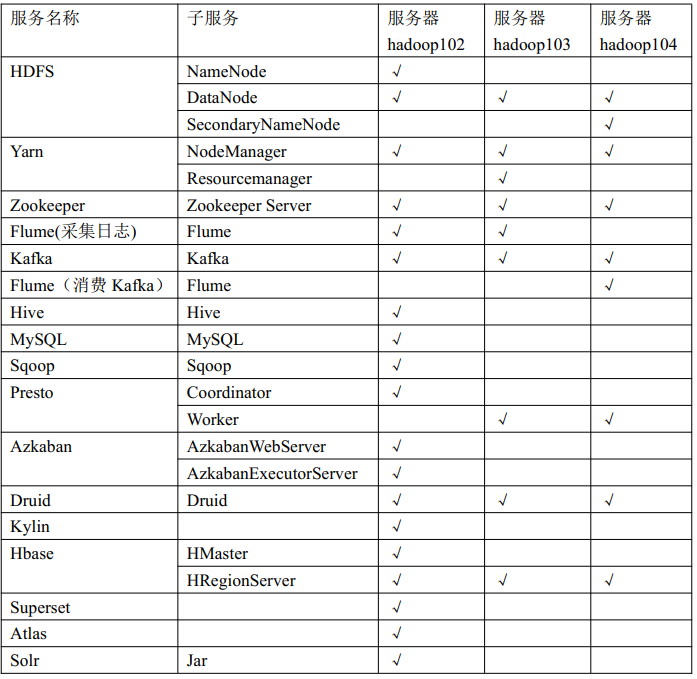

**从此篇开始，我将利用一个==电商的大数据数据仓库项目==，实际的去讲一下各种组件的安装和操作。**

图片镇楼~~~



关于Hive的重点知识，大家可以自行搜索，特别是Hive SQL如何转换为MapReduce任务的，其中最常见的数据倾斜是怎么发生的，如原理什么，如何避免，这需要大家多理解理解，对以后优化Hive SQL帮助很大。

由于一般而言Hive的元数据是存在MySQL中的，因此我们要先安装MySQL。


## 安装MySQL

**1、安装包准备**

1） 查看 MySQL 是否安装， 如果安装了， 卸载 MySQL
（1） 查看
`[root@hadoop102 桌面]# rpm -qa|grep mysql`
mysql-libs-5.1.73-7.el6.x86_64
（2） 卸载
`[root@hadoop102 桌 面 ]# rpm -e --nodeps mysql-libs-5.1.73-7.el6.x86_64`
2） 解压 mysql-libs.zip 文件到当前目录
`[root@hadoop102 software]# unzip mysql-libs.zip`
`[root@hadoop102 software]# ls`
mysql-libs.zip
mysql-libs
3） 进入到 mysql-libs 文件夹下


**2、安装MySQL服务器**

1） 安装 mysql 服务端
`[root@hadoop102 mysql-libs]# rpm -ivh`
MySQL-server-5.6.24-1.el6.x86_64.rpm
2） 查看产生的随机密码
`[root@hadoop102 mysql-libs]# cat /root/.mysql_secret`
OEXaQuS8IWkG19Xs
3） 查看 mysql 状态
`[root@hadoop102 mysql-libs]# service mysql status`
4） 启动 mysql
`[root@hadoop102 mysql-libs]# service mysql start  `


**3、安装MySQL客户端**

1） 安装 mysql 客户端
`[root@hadoop102 mysql-libs]# rpm -ivh`
MySQL-client-5.6.24-1.el6.x86_64.rpm
2） 连接mysql
`[root@hadoop102 mysql-libs]# mysql -uroot -pOEXaQuS8IWkG19Xs`
3） 修改密码
`mysql>SET PASSWORD=PASSWORD('root');`
4） 退出 mysql
`mysql>exit  `


**4、MySQL 中 user 表中主机配置**  

进入 mysql
`[root@hadoop102 mysql-libs]# mysql -uroot -proot`

```mysql
mysql>use mysql;
mysql>select User, Host, Password from user;
mysql>update user set host='%' where host='localhost';
# 删除 root 用户的其他 host
mysql>delete from user where Host='hadoop102';
mysql>delete from user where Host='127.0.0.1';
mysql>delete from user where Host='::1';
# 刷新
mysql>flush privileges;
# 退出
mysql>quit;
```

